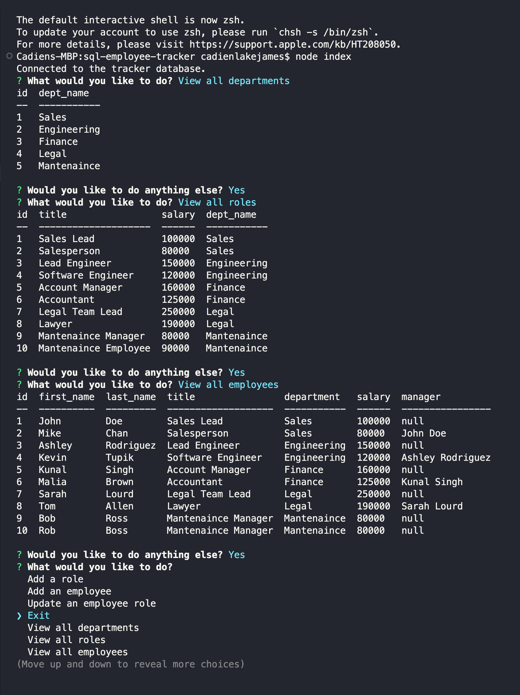

# SQL-Employee-Tracker

## Table of Contents

- [General Info](#general-information)
- [Features](#features)
- [Screenshot](#screenshot)
- [Video Demonstration](#video-demonstration)
- [Project Status](#project-status)
- [Acknowledgements](#acknowledgements)

## General Information

-This is a command line application that allows you to manage a database of departments, roles, and employees from within your console.

## Features

-This application utilizes mysql to create and store our database, inquirer to facilitate our command line interactions, and cTable to display our databases in an aesthetically pleasing manner in the console. You can view departments, roles, and employees, as well as add departments, roles, and employees, and even update an employees role and manager.

## Screenshot

## Video Demonstration

> You can view a video demonstration [_here_](https://drive.google.com/file/d/1MlYC0T1qGQl2E6nwM3oN3AraFqPITxPd/view?usp=sharing).

## Project Status

Project is: _finished_.

## Acknowledgements

- This project was created with assistance from our bootcamp instructor and student conversations. Thanks for the teamwork!
